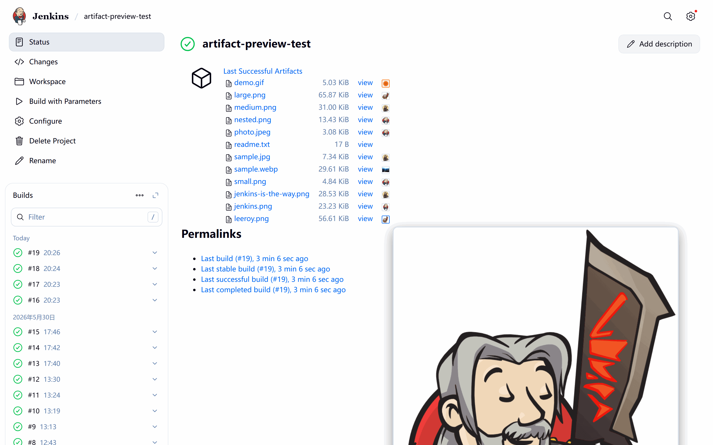
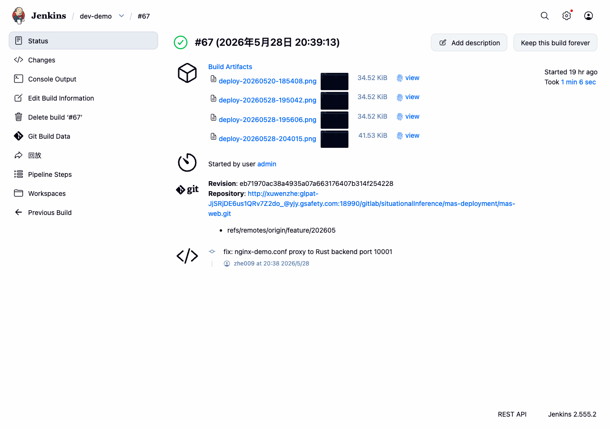
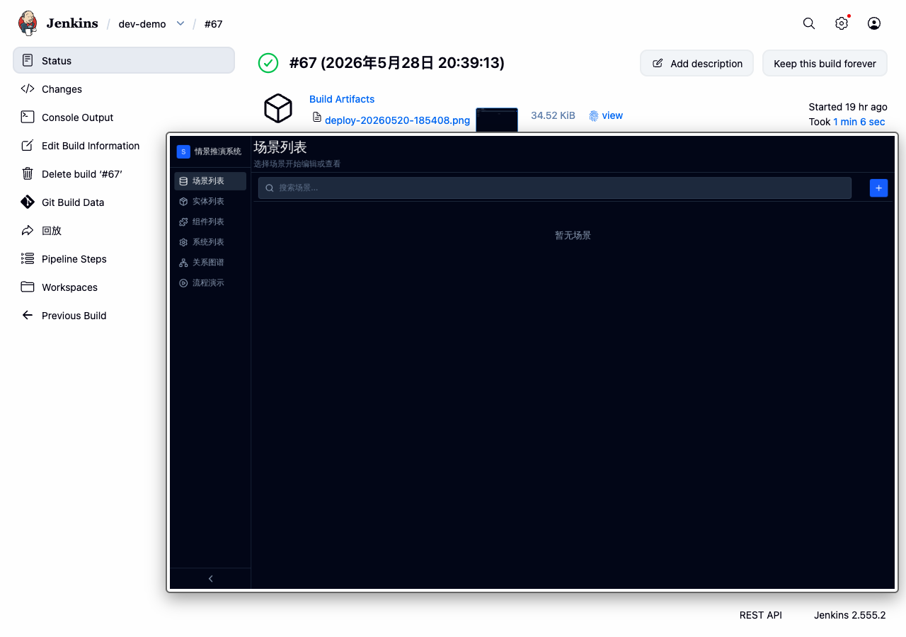
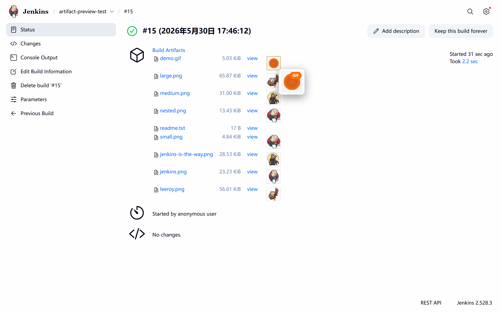

# Artifact Image Preview Plugin for Jenkins

[](https://plugins.jenkins.io/artifact-image-preview)
[](LICENSE)

[中文文档](README_zh.md)

A Jenkins plugin that adds thumbnail previews and hover-to-zoom for image artifacts on build pages.

## Demo



## Features

- **Thumbnail Preview** — auto-displays thumbnails next to image artifact links
- **Hover-to-Zoom** — hover a thumbnail to show a large popup preview
- **GIF Animation** — GIF files get an orange border, "GIF" badge, and auto-play in popup
- **Click to Open** — click any thumbnail to open full-size in new tab
- **Formats** — PNG, JPG/JPEG, GIF, WebP, SVG, BMP
- **Zero Config** — works automatically after installation
- **Lightweight** — pure CSS + vanilla JS via `PageDecorator`, no dependencies

## Screenshots

| Thumbnails | Hover Preview | GIF Hover |
|:---:|:---:|:---:|
|  |  |  |

## How It Works

1. `ImagePreviewPlugin` extends `PageDecorator` → Jenkins loads `header.jelly` into every page
2. JS scans `<a href*="artifact/">` links, filters by image extension
3. Creates `` thumbnails after each link; GIF files get orange border + "GIF" badge
4. `mouseenter`/`mousemove` shows a fixed popup; `mouseleave` hides it
5. `MutationObserver` handles dynamically loaded content

## Requirements

- Jenkins 2.440.3+
- Java 11+
- Maven 3.8+

## Build & Install

```bash
mvn clean package -DskipTests
```

Upload `target/artifact-image-preview.hpi` via **Manage Jenkins → Plugins → Advanced → Upload Plugin**, then restart.

Or manually copy to `$JENKINS_HOME/plugins/` and restart.

## License

[MIT](LICENSE)
