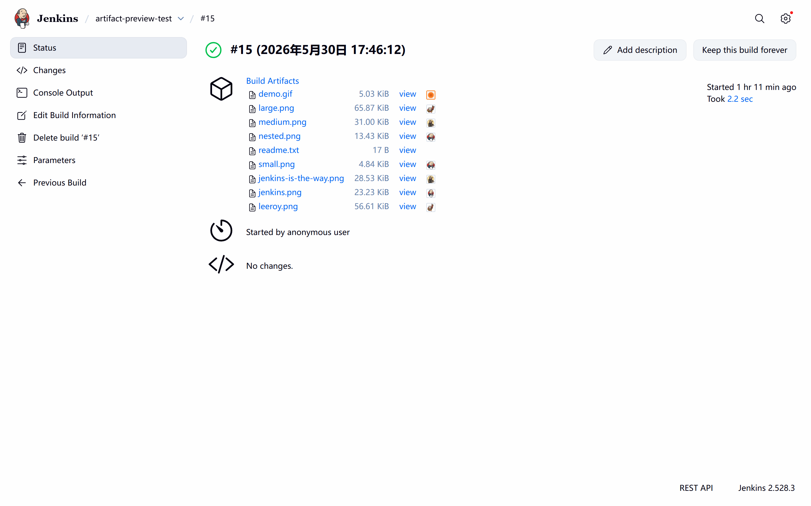
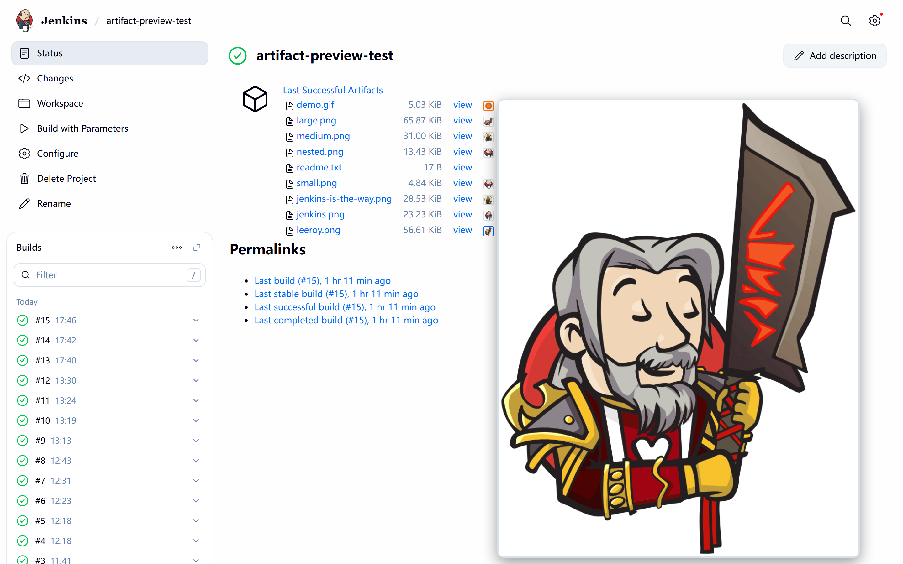
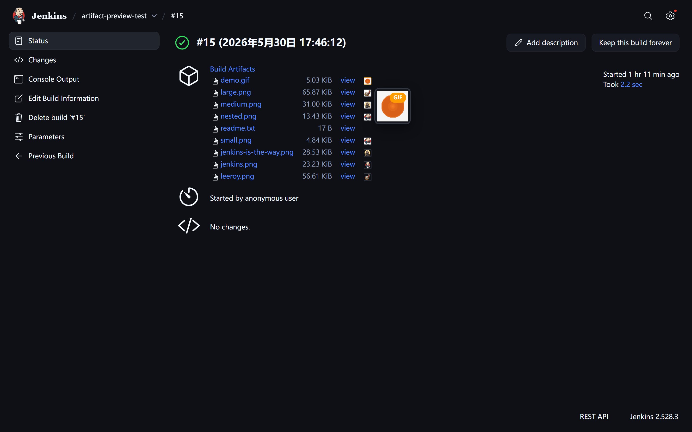

# Jenkins 图片 Artifact 预览插件

[](https://plugins.jenkins.io/artifact-image-preview)
[](LICENSE)

[English](README.md)

在任务页和构建页为图片 Artifact 显示缩略图，悬停放大预览。安装即用，无需配置。

## 演示



## 功能

- 任务页（*Last Successful Artifacts*）与构建页（*Build Artifacts*）显示缩略图
- 悬停缩略图弹出大图预览
- GIF 文件：橙色边框、**GIF** 标签、弹窗内自动播放
- 点击缩略图在新标签页打开原图
- 支持 PNG、JPG/JPEG、GIF、WebP、BMP

## 截图

| 构建页面 | 任务页面（悬停） | 构建页面（悬停，暗色） |
|:---:|:---:|:---:|
|  |  |  |

## 安装

通过 **Manage Jenkins → Plugins → Advanced → Upload Plugin** 上传 `artifact-image-preview.hpi`，然后重启 Jenkins。

需要 Jenkins 2.440.3+。

从源码构建：

```bash
mvn clean package -DskipTests
```

## 许可证

[MIT](LICENSE)
